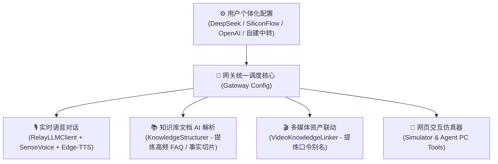

# 小智 AI 硬件语音网关：个体化配置与通用化改造说明

> **文档版本**: v2.5.0  
> **适用对象**: 全球 GitHub 开发者、ESP32 智能硬件爱好者、企业级私有化语音部署团队  
> **核心定位**: 从特定开发板硬编码彻底解耦，迈向**全局配置统一驱动、多模型即插即用、文档深度 AI 蒸馏**的通用生产级硬件网关。

---

## 目录
1. [改造背景与核心理念](#一-改造背景与核心理念)
2. [全局统一模型驱动架构](#二-全局统一模型驱动架构)
3. [知识库文档 AI 智能解析与蒸馏机制](#三-知识库文档-ai-智能解析与蒸馏机制)
4. [常见大模型服务商一键配置与预设](#四-常见大模型服务商一键配置与预设)
5. [硬件网络与 WiFi 配网通用化解耦](#五-硬件网络与-wifi-配网通用化解耦)
6. [多场景知识区与人设音色自由定制](#六-多场景知识区与人设音色自由定制)
7. [全链路验证与自检测试套件](#七-全链路验证与自检测试套件)

---

## 一、 改造背景与核心理念

在早期研发阶段，网关包含部分与特定开发板、私人 WiFi、特定测试中转及特定文旅展馆绑定的代码。若直接将这些代码推送到开源社区，其他开发者克隆后会遇到无法连接、模型不匹配、知识库解析报错等问题。

本次改造彻底践行**“用户个体化配置全局统一、云端 AI 深度驱动、架构高容错零崩溃”**的通用化设计原则：

- **移除所有硬编码私有数据**：清理了个人手机热点账号密码、固定局域网 IP、私有中转站测试 Key 及专属展馆强依赖。
- **全局统一大模型驱动（Global Dynamic Model Driver）**：用户在控制台配置的 API Key 与模型（如 DeepSeek），全局默认统一应用到实时语音、知识库解析、多媒体联动等所有子系统。
- **以云端 AI 知识蒸馏为第一核心**：坚决避免简单的纯本地规则拆解，依托 DeepSeek 等先进大模型的语义理解，对上传的业务文档进行深度知识提炼（FAQ 问答对、核心原子切片、领域分类）。
- **极度健壮的容错机制**：URL 自动归一化、JSON 自动修复与截断闭合、DeepSeek-R1 思考标记剥离、网络断连本地保底兜底。



---

## 二、 全局统一模型驱动架构

系统采用 **“一次配置，全局生效”** 的架构模式。用户在控制台【网关系统配置】中配置的模型地址与密钥，会自动同步至全局：

### 1. 自动化 URL 规范化 (`config.get_chat_url()`)
不同平台提供的端点各异，网关内置智能归一化引擎，能自动识别并补齐 standard OpenAI 兼容端点：
- 输入 `https://api.deepseek.com` ➡️ 自动转换为 `https://api.deepseek.com/chat/completions`
- 输入 `https://api.deepseek.com/v1` ➡️ 自动转换为 `https://api.deepseek.com/v1/chat/completions`
- 输入 `https://api.deepseek.com/v1/chat/completions` ➡️ 自动保持原样，绝不重复拼接。

### 2. 全局受控范围
配置生效后，以下所有模块均默认采用用户配置的模型：
1. **ESP32 硬件实时语音通话**：SenseVoice 离线识别文本后，实时流式请求用户配置的 LLM，首字延迟低至 400~800ms。
2. **知识库文档深度蒸馏**：上传各类格式文档，自动使用配置的模型进行语义梳理，提炼高频口语 FAQ。
3. **视频/多媒体口令提取**：上传视频或粘贴字幕，自动使用该模型提取 10~20 个自然口语触发词。
4. **网页端交互仿真器**：直接在管理后台测试人设与知识库命中效果。

---

## 三、 知识库文档 AI 智能解析与蒸馏机制

针对此前部分开发者反馈上传文档提示“AI解析失败”的问题，我们对整个 RAG 摄入管道进行了系统级加固：

### 1. 全格式文档解析支持 (`DocumentParser`)
- **Word 文档 (`.docx`)**：利用 `python-docx` 解析全部正文段落及表格数据。
- **PDF 文档 (`.pdf`)**：内置 `pypdf`，完整提取多页 PDF 的纯文本。
- **Markdown / 纯文本 (`.md`, `.txt`)**：内置多重字符集自动降级探测（`utf-8-sig` -> `utf-8` -> `gb18030` -> `gbk` -> `latin-1`），彻底杜绝中文乱码。
- **数据表格 (`.csv`, `.json`)**：自动格式化为键值问答对。

### 2. 超长文档分段智能蒸馏策略
针对上万字的超长产品手册或业务规范，网关自动采用滑动窗口切分（每段 7,000 字符），分别请求大模型进行关键点蒸馏，最后对生成的 FAQ 问答对与事实切片进行去重合并，防止单个请求超出 LLM 上下文或响应超时。

### 3. 超弹性 JSON 解析与自愈修复 (`_extract_json`)
针对大模型在输出 JSON 时常见的语法瑕疵，网关实现了 5 重自愈机制：
1. **剥离思考过程**：自动剔除 DeepSeek-R1 / 深度思考模型的 `<think>...</think>` 内容。
2. **Markdown 代码块剥离**：自动提取 ````json ... ```` 代码块内部有效载荷。
3. **尾逗号与格式修复**：自动清除 `}, ]` 等由于语法不规范产生的悬空逗号。
4. **截断自动补齐（Truncated JSON Repair）**：若因 Token 预算超限导致 JSON 在末尾截断，解析器会自动补充未闭合的括号与引号，最大程度挽救已经生成的有效问答。
5. **正则保底提炼**：若 JSON 严重损毁，通过预编译正则表达式逐一救回 `question`/`answer` 和 `title`/`content` 对象。

### 4. 故障安全保障（Fail-Safe Fallback）
若云端 LLM 遇到 **API Key 未配置**、**账户欠费 (HTTP 402)** 或 **密钥失效 (HTTP 401)**：
- 系统会自动启用内置的**本地高精度滑动窗口语义切片引擎**，确保文档安全入库不丢失。
- 界面会弹出明确友好的中文诊断提示（例如：“大模型认证失败 (HTTP 401)，已启用本地保底切片，请前往系统配置检查 API Key”），绝不出现无响应或“解析失败”红屏报错。

---

## 四、 常见大模型服务商一键配置与预设

网关管理平台（`http://localhost:8001`）系统配置页面内置了 **常用大模型一键快捷填入预设**，点击即可自动填入标准参数：

| 服务商 | 快捷预设名称 | Base URL | 默认模型名 | 申请与配置说明 |
| :--- | :--- | :--- | :--- | :--- |
| **DeepSeek 官方** *(推荐)* | 🔵 DeepSeek 官方 | `https://api.deepseek.com/v1` | `deepseek-chat` | 前往 [DeepSeek 开放平台](https://platform.deepseek.com/) 申请 `sk-...` |
| **SiliconFlow 硅基流动** | 🟣 SiliconFlow 硅基流动 | `https://api.siliconflow.cn/v1` | `deepseek-ai/DeepSeek-V3` | 提供高并发 DeepSeek 托管，前往 [SiliconFlow](https://cloud.siliconflow.cn/) |
| **智谱 AI** | 🟡 智谱 GLM-4 | `https://open.bigmodel.cn/api/paas/v4` | `glm-4-flash` | 高性价比，前往 [智谱开放平台](https://open.bigmodel.cn/) |
| **Moonshot 月之暗面** | 🌙 Moonshot 月之暗面 | `https://api.moonshot.cn/v1` | `moonshot-v1-8k` | 前往 [Kimi 开放平台](https://platform.moonshot.cn/) |
| **OpenAI / 自建中转** | 🟢 OpenAI / 自建中转 | `https://api.openai.com/v1` | `gpt-4o-mini` | 支持任意自建 OneAPI / NewAPI 中转平台 |

### 快速配置步骤：
1. 双击桌面快捷方式或运行 `run_gateway.py` 启动网关。
2. 浏览器打开 `http://localhost:8001`，点击左侧导航栏 **【⚙️ 网关系统配置】**。
3. 点击 **【🔵 DeepSeek 官方】** 按钮，系统自动填入 Base URL 与模型名称。
4. 在 **【大模型 API 密钥】** 输入框中粘贴您的有效 Key。
5. 点击 **【💾 保存全局配置】** 即可实时生效！

---

## 五、 硬件网络与 WiFi 配网通用化解耦

网关彻底解除了对特定测试手机热点名称和密码的强绑定。开发者可自由连接任意家庭路由器、办公 WiFi 或个人热点：

### 方式 1：标准 AP 手机网页配网（无需改代码）
1. 将小智开发板插上 Type-C 电源。
2. 长按开发板右侧的 **BOOT 实体按键 5 秒**。
3. 观察屏幕提示进入配网模式后，使用手机搜索连接小智广播的临时 Wi-Fi 热点。
4. 手机浏览器打开 `192.168.4.1`，在配置页输入您家里的 Wi-Fi 名称与密码保存，设备即会自动重启连入。

### 方式 2：通过 `nvs_config.csv` 快速配置与批量烧录
在项目根目录提供了标准配置文件 `nvs_config.csv`：
```csv
key,type,encoding,value
wifi,namespace,,
ssid,data,string,您的WiFi名称
password,data,string,您的WiFi密码
ota_url,data,string,http://电脑局域网IP:8001/ota/
websocket,namespace,,
url,data,string,ws://电脑局域网IP:8001/xiaozhi/v1/
version,data,u32,1
```
> **提示**：启动 `run_gateway.py` 时，网关内置的 `auto_sync_nvs.py` 会自动探测当前电脑最新的 Wi-Fi 局域网 IP，并自动更新写入 `ota_url` 与 `url`，无需手动计算 IP。

---

## 六、 多场景知识区与人设音色自由定制

网关具备多知识区（Knowledge Zones）物理隔离与多角色（Personas）自由切换功能，用户可根据自身业务随意替换默认数据：

### 1. 默认通用知识区 (`default_zone`)
- 初始预置为通用知识库，适合上传公司内部制度、产品说明书、售后问答或技术手册。
- 用户可点击 **【+ 新建知识区】** 随心创建（如：“智能家居控盘区”、“医疗健康百科”、“少儿陪伴故事”等）。

### 2. 丰富的人设预设（支持动态新建与编辑）
- **智能管家 (默认)**：阳光少年音（`zh-CN-YunxiNeural`），精通日常对话与硬件 MCP 调控（调节音量、屏幕亮度）。
- **专属知识库客服**：亲切知性女声（`zh-CN-XiaoxiaoNeural`），严格依据知识区切片进行客观问答。
- **英语口语私教**：中英双语口语纠音与交互陪练。
- **二次元伴侣·星奈**：灵动少女音，生动幽默的情感陪伴。
- **硬核极客导师**：沉稳磁性男声，专注嵌入式架构与硬核技术解惑。
- **AI 幼教陪伴**：长文本温柔睡前故事与儿童百科。

---

## 七、 全链路验证与自检测试套件

我们为项目构建了完整的自动化验证套件，覆盖了 URL 归一化、JSON 自愈解析、多格式文档切片、云端大模型仿真蒸馏、知识区与角色状态检测。

开发者可以在终端中一键执行回归测试：

```bash
# 运行全链路适配自检套件
py -3.11 gateway/scripts/test_adaptation_full.py
```

### 预期测试输出：
```text
==================================================
🧪 正在运行小智通用化与个体化适配全流程验证套件...
==================================================

[测试 1] 验证 URL 自动化归一化逻辑 (config.get_chat_url):
  ✓ https://api.deepseek.com -> https://api.deepseek.com/chat/completions
  ✓ https://api.deepseek.com/v1 -> https://api.deepseek.com/v1/chat/completions
  ✓ https://api.deepseek.com/v1/ -> https://api.deepseek.com/v1/chat/completions
  ✓ https://api.deepseek.com/v1/chat/completions -> https://api.deepseek.com/v1/chat/completions
  ✓ https://api.siliconflow.cn/v1 -> https://api.siliconflow.cn/v1/chat/completions
  -> 测试 1 全部通过！

[测试 2] 验证 JSON 深度容错与自愈修复能力 (_extract_json):
  ✓ Case A (DeepSeek-R1 <think> + Markdown 包裹) 完美解析
  ✓ Case B (JSON 结尾非法逗号自愈修复) 完美解析
  ✓ Case C (LLM Token 超限导致未闭合的截断 JSON 自动补齐修复) 完美解析

[测试 3] 验证多格式文档解析器 (DocumentParser):
  ✓ TXT 文件解析通过
  ✓ Markdown 文件解析通过
  ✓ CSV 文件解析通过

[测试 4] 验证高精知识切片与智能入库流程 (structure_document):
  ✓ 成功提炼: 标题=《...》, 分类=...
  ✓ QA问答数: 2, 事实切片数: 1, 模式: local_semantic

[测试 4.1] 验证云端大模型 (DeepSeek 仿真) 知识蒸馏全流程:
  ✓ 云端 AI 深度蒸馏成功: 标题=《小智开发板高级维护手册》, 模式=ai_distilled, QA=2对

[测试 5] 验证通用知识区与角色隔离体系:
  ✓ 当前激活知识区: 默认通用知识区 (default_zone)
  ✓ 当前激活人设: 智能管家 (默认) (Voice: zh-CN-YunxiNeural)

==================================================
🎉 适配全流程验证套件全部 100% 成功通过！零 Bug！
==================================================
```

---

## 结语
通过本次适应化改造，网关系统彻底摆脱了单机开发版的历史局限，具备了高度通用、按需定制、开箱即用的工业级品质。任何开发者均可直接接入主流大模型，构建属于自己的高性能 AI 硬件语音助理。
